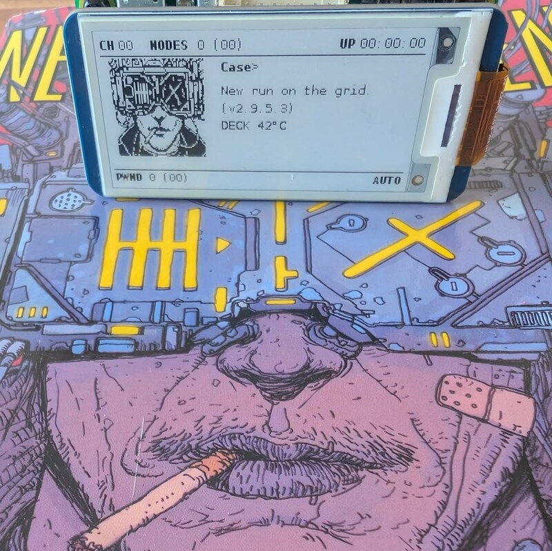
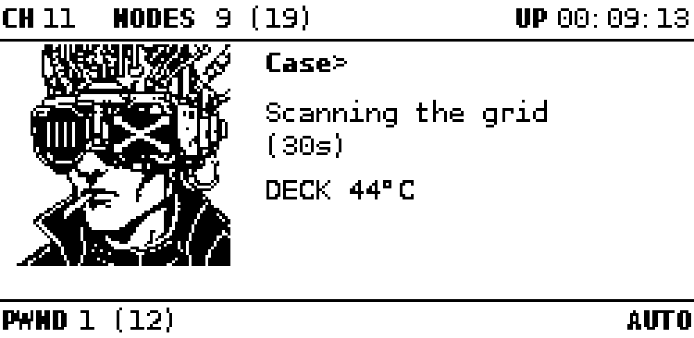
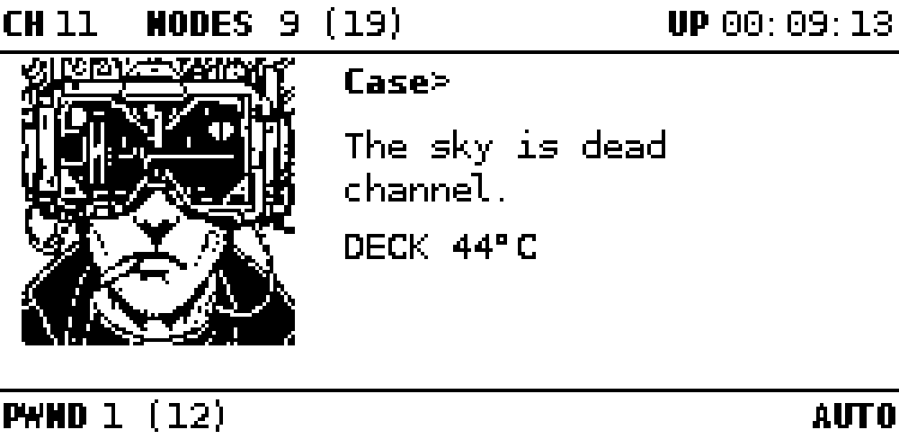

# pwnagotchi-neuromancer

[](https://github.com/wackojice/pwnagotchi-neuromancer/releases/latest)
[](LICENSE)

> *The sky above the port was the color of television, tuned to a dead channel.*
>
> — William Gibson, *Neuromancer* (1984)

A theme for [pwnagotchi](https://pwnagotchi.ai/): the ASCII face is replaced by
a cyberpunk pixel-art portrait, the status lines speak William Gibson's
language, and an **ICE BROKEN** screen fires on every captured handshake.



| Scanning | Flatlined |
|---|---|
|  |  |

Two of the fourteen faces, and two of the 104 lines — rendered at actual size
with `tools/preview.py`, which recomposes the screen exactly as the driver
lays it out. The rest turn up as your pwnagotchi lives its day, including the
**ICE BROKEN** screen you will meet the first time it breaks a handshake.

## Contents

- [What it does](#what-it-does)
- [Requirements](#requirements)
- [Install](#install)
- [Uninstall](#uninstall)
- [The faces](#the-faces)
- [The voice](#the-voice)

Deeper, in `docs/`:

- [Compatibility](docs/COMPATIBILITY.md) — screens, pwnagotchi releases, and what was tested on real hardware
- [Configuration](docs/CONFIGURATION.md) — every setting, the status bar, the deck reading
- [Drawing your own faces](docs/DRAWING-FACES.md) — sizes, the two axes, and what does not survive scaling
- [How it works](docs/HOW-IT-WORKS.md) — the plugin hooks, and previewing without hardware
- [Installing on a Raspberry Pi](docs/INSTALLATION-PI.md) — step by step, from a blank card

## What it does

- replaces all 25 ASCII faces with 14 one-bit pixel-art portraits
- rewrites all 104 pwnagotchi lines into the Neuromancer universe
- shows a dedicated screen for a few seconds after each handshake, with the
  target SSID
- displays the SoC temperature, and rearranges the layout to fit the portrait

The plugin **does not modify pwnagotchi**: it installs as a custom plugin and a
standard gettext locale, and both switch off with one config line.

## Requirements

**A working pwnagotchi.** This is a theme, not a distribution: it installs on
top of an existing setup and does nothing on its own. If you do not have one
yet, start there:

- [pwnagotchi.ai](https://pwnagotchi.ai/) — the project, and how to flash an
  image onto a Raspberry Pi
- [jayofelony/pwnagotchi](https://github.com/jayofelony/pwnagotchi) — the
  actively maintained fork, with ready-made images

Tested on real hardware, three setups — from the oldest release these boards
can run to the newest there is:

| Board | pwnagotchi | Arch | Display |
|---|---|---|---|
| Raspberry Pi Zero W | 2.9.5.3 | armv6l (32-bit) | `waveshare_2` |
| 64-bit Raspberry Pi | 2.9.5.4 | aarch64 | `waveshare_4`, rotated 180° |
| 64-bit Raspberry Pi | **2.9.5.8** | aarch64 | `waveshare_4`, rotated 180° |

Other screens should work — the layout adapts to whatever the driver reports.
See [Compatibility](docs/COMPATIBILITY.md) for the geometries verified in
simulation.

Nothing else is needed: no extra Python package, no internet access on the pi.
The plugin only uses what pwnagotchi already ships (Pillow, gettext).

## Install

On the pwnagotchi itself:

```bash
git clone https://github.com/wackojice/pwnagotchi-neuromancer.git
cd pwnagotchi-neuromancer
sudo ./install.sh
```

The script copies the images, installs the plugin in whichever directory your
version scans, installs the voice next to the other locales, enables both in
`/etc/pwnagotchi/config.toml` (backing it up first) and restarts the service.

### No USB data cable? Install from the SD card

Everything here runs **on your computer**, not on the pi. Power the pi off and
put its card in your card reader — most desktops mount both partitions
automatically as `bootfs` and `rootfs`.

```bash
# 1. clone this repository on your computer
git clone https://github.com/wackojice/pwnagotchi-neuromancer.git
cd pwnagotchi-neuromancer

# 2. find where the card is mounted
lsblk -o NAME,SIZE,FSTYPE,LABEL,MOUNTPOINT

# 3. install onto it, passing the rootfs mountpoint
sudo ./tools/install-sdcard.sh /run/media/$USER/rootfs

# 4. unmount BOTH partitions before pulling the card
udisksctl unmount -b /dev/sdX2    # rootfs
udisksctl unmount -b /dev/sdX1    # bootfs
```

Replace `sdX` with your card's actual device from step 2 — and double-check it,
since `dd`-style mistakes on the wrong disk are unforgiving.

The script prints the configuration it found before touching anything:

```
==> Target: /run/media/you/rootfs
    name = "your-pwnagotchi"
    type = "waveshare_2"
==> Images -> /usr/local/share/neuromancer
==> Plugin -> /usr/local/share/pwnagotchi/custom-plugins/
==> Neuromancer voice
==> Configuration
    backup: config.toml.bak.*
    plugin enabled (sections style config)
    language was "en", switched to neuromancer
```

Check that the name and display are the ones you expect before letting it
continue.

This is also the safer route for a first attempt: if the system fails to boot,
you just put the card back in your computer and undo it — whereas a boot failure
leaves you with no SSH access at all.

### Manual install

Four things get installed: the images, the plugin, the voice, and two config
keys. Miss the third and the faces appear but pwnagotchi keeps speaking plain
English.

```bash
# 1. images
sudo mkdir -p /usr/local/share/neuromancer
sudo cp images/*.png /usr/local/share/neuromancer/

# 2. plugin -- into whichever directory your version scans
PLUGINS="$(grep -oP '^\s*(main\.)?custom_plugins\s*=\s*"\K[^"]+' /etc/pwnagotchi/config.toml 2>/dev/null | head -1)"
PLUGINS="${PLUGINS:-/usr/local/share/pwnagotchi/custom-plugins/}"
sudo mkdir -p "$PLUGINS" && sudo cp neuromancer.py "$PLUGINS"

# 3. voice -- next to pwnagotchi's other locales, wherever its package lives
LOCALE="$(sudo find / -maxdepth 8 -type d -path '*pwnagotchi/locale' 2>/dev/null | head -1)"
sudo mkdir -p "$LOCALE/neuromancer/LC_MESSAGES"
sudo cp locale/neuromancer/LC_MESSAGES/voice.mo "$LOCALE/neuromancer/LC_MESSAGES/"
```

**4. enable both in `/etc/pwnagotchi/config.toml`** — back it up first, and mind
the format your file already uses. pwnagotchi rewrites configs into the second
form after its first run, so check before editing:

<table>
<tr><th>Flat keys</th><th>Sections</th></tr>
<tr><td>

```toml
main.plugins.neuromancer.enabled = true
main.lang = "neuromancer"
```

</td><td>

```toml
[main]
lang = "neuromancer"

[main.plugins.neuromancer]
enabled = true
```

</td></tr>
</table>

Mixing them silently fails: a flat key appended to a file using sections becomes
part of whatever section precedes it, and the plugin never loads. If in doubt,
let the script do it:

```bash
sudo python3 tools/configure.py /etc/pwnagotchi/config.toml enable
```

```bash
sudo systemctl restart pwnagotchi
```

## Uninstall

```bash
sudo ./uninstall.sh
sudo systemctl restart pwnagotchi
```

It disables the plugin, removes the plugin file, the images, the locale and the
trace file, then restores the language you had before installing — recorded at
install time rather than guessed.

It is deliberately cautious: if you changed `main.lang` yourself after
installing, it says so and leaves it alone. `config.toml` is backed up first, as
with every run.

### First boot: expect one restart

After installing, the first start is not the smooth one. Case appears, sits
still for twenty or thirty seconds, then the screen clears and the whole thing
comes back — and *that* run is the one that works, with the face changing and
the lines scrolling.

Nothing is wrong: pwnagotchi restarts itself after finding a modified
`config.toml`. Let it. On a Pi Zero W the two boots together can take several
minutes, since the display only refreshes on a real change and gives no sign of
progress meanwhile.

Some setups do this on **every** boot, not just the first — one device tested
here had been doing so for months before the theme was ever installed. As long
as the second run works, it is a pwnagotchi habit rather than a theme problem.

You may also see the green LED blinking **two flashes, repeatedly**, with
nothing on the screen. That code means the bootloader cannot read the SD card
yet. It is worth waiting: on a Pi Zero W it has been seen blinking for a long
while and then booting normally. If it never gets past it, reseat the card —
the Zero's slot is a plain slide-in with no click, and it is easy to leave one
three-quarters of the way in.

### Checking it works

```bash
journalctl -u pwnagotchi -f | grep neuromancer
```

The plugin also writes its startup steps to `neuromancer-trace.txt` on the boot
partition, flushed to disk immediately — readable from any computer by pulling
the card, and it survives an unclean shutdown. That file is what found the race
condition described in [How it works](docs/HOW-IT-WORKS.md).

## The faces

| File | State | Mapped from |
|---|---|---|
| `awake.png` | neutral, visor lit, cigarette | `AWAKE`, `COOL`, `INTENSE`, `SMART`, `MOTIVATED`, `DEBUG` |
| `happy.png` | half-smile, cigarette | `HAPPY`, `GRATEFUL`, `EXCITED`, `FRIEND` |
| `look_l.png` / `look_r.png` | glancing sideways | `LOOK_L`, `LOOK_R` and their *happy* variants |
| `sleep.png` | dark lenses, a `Z` in each, mouth ajar, cigarette gone | `SLEEP`, `SLEEP2` |
| `bored.png` | visor flatlined | `BORED`, `DEMOTIVATED` |
| `sad.png` | flatlined, a broken heart, mouth down | `SAD` — boredom gone on |
| `lonely.png` | mouth down, cigarette drooping | `LONELY` |
| `angry.png` | mouth wide open, still holding the cigarette | `ANGRY` |
| `broken.png` | teeth clenched | `BROKEN` — a fault, or an automatic restart |
| `upload.png` / `upload1.png` / `upload2.png` | a progress bar filling up | `UPLOAD`, `UPLOAD1`, `UPLOAD2` |
| `ice.png` | shattered ice | shown after a handshake |

After a handshake the ice screen holds for `PWN_SECONDS`, then `happy.png`
for `SMILE_SECONDS`, then the face follows the core again. The core does set
`HAPPY` on a handshake — but it does so during the very seconds the ice
screen covers, so the grin was never actually seen. Holding it just after
puts it back: he breaks the ice, then he grins.

All images are 76-77 × 80, **pure 1-bit**, no antialiasing. Every state
pwnagotchi defines is covered, so nothing falls back to a default face.

The face reads on two axes, which is what makes the states tell apart at a
glance on e-ink: **the visor carries the machine's state** (lit, dark, flatlined,
transferring) and **the mouth carries the mood** (neutral, smiling, shouting,
asleep). Each image changes one of the two, rarely both.

The three `upload` images are not an animation the plugin plays: pwnagotchi
cycles through its three upload states on its own, and the bar advances because
the state changed.

### Variants

Any face can have alternates: `awake.png`, then `awake_2.png`, `awake_3.png`
and so on. One is picked at random whenever the core moves to a different
state, so a face that carries several states stops sitting still through all
of them — `AWAKE`, `COOL`, `SMART` and `MOTIVATED` all land on `awake`, and
without this the screen never changed across the four.

The underscore matters. `upload2.png` is a state of its own, not a second
drawing of `upload`; only `_2` and up are read as alternates. Loading stops at
the first gap, so `_2` and `_4` without a `_3` leaves the fourth unread.

`awake_2.png` ships as an example: the same face, with the cigarette smoking.
A good variant changes one small area and leaves the silhouette alone —
redrawing an outline makes the head appear to jump between frames.

`MAPPING` at the top of the plugin can be rearranged freely: several states may
point at the same image, and `awake.png` is the fallback for anything unmapped.

## The voice

The theme installs a **complete locale** rewriting all 104 pwnagotchi lines.

| pwnagotchi | Neuromancer |
|---|---|
| `Hi, I'm Pwnagotchi! Starting ...` | `Case online. Jacking in...` |
| `Hack the Planet!` | `Burn the ICE.` |
| `No more mister Wi-Fi!!` | `No more mister nice deck.` |
| `I'm bored ...` | `Static. Nothing but static.` |
| `I pwn therefore I am.` | `I break ICE, therefore I am.` |
| `I dreamed of electric sheep` | `I dreamed of Wintermute` |
| `Deauthenticating {mac}` | `Flatlining {mac}` |
| `Cool, we got 3 new handshakes!` | `ICE BROKEN. 3 keys.` |
| `I'm dead, Jim!` | `I flatlined.` |

This is **standard gettext**: no pwnagotchi source is touched. The locale sits
alongside the other 184 and is enabled with one line —

```toml
main.lang = "neuromancer"
```

— and disabled by going back to `main.lang = "en"`.

Every line fits within 40 characters, the status field's display limit
(20 characters per line, two lines). To edit them:

```bash
$EDITOR locale/neuromancer/LC_MESSAGES/voice.po
msgfmt -o locale/neuromancer/LC_MESSAGES/voice.mo \
       locale/neuromancer/LC_MESSAGES/voice.po
```

## Licence

GPL-3.0 — same as pwnagotchi, whose interfaces this plugin uses.

The name and look reference William Gibson's *Neuromancer*. Unofficial project,
no affiliation.
