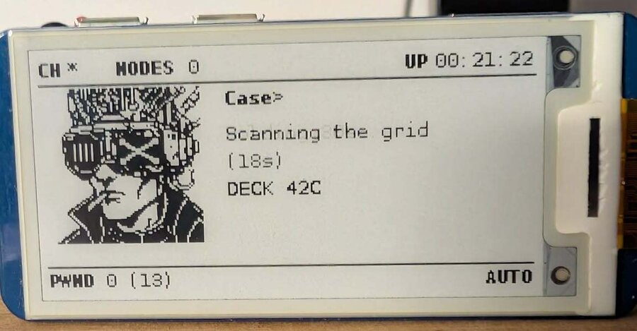
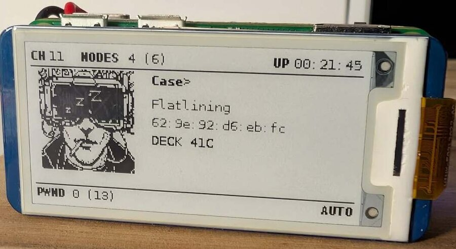
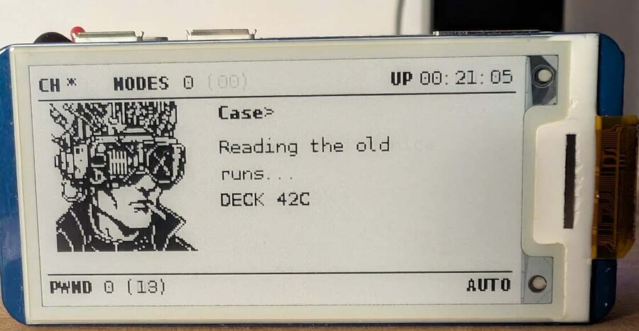

# pwnagotchi-neuromancer

A theme for [pwnagotchi](https://pwnagotchi.ai/): the ASCII face is replaced by
a cyberpunk pixel-art portrait, the status lines speak William Gibson's
language, and an **ICE BROKEN** screen fires on every captured handshake.



| Deauthenticating a client | Booting up |
|---|---|
|  |  |

## What it does

- replaces the 19 ASCII faces with 5 one-bit pixel-art portraits
- rewrites all 104 pwnagotchi lines into the Neuromancer universe
- shows a dedicated screen for a few seconds after each handshake, with the
  target SSID
- displays the SoC temperature, and rearranges the layout to fit the portrait

The plugin **does not modify pwnagotchi**: it installs as a custom plugin and a
standard gettext locale, and both switch off with one config line.

## Install

On the pwnagotchi itself:

```bash
git clone https://github.com/wackojice/pwnagotchi-neuromancer.git
cd pwnagotchi-neuromancer
sudo ./install.sh
```

The script copies the images, installs the plugin in whichever directory your
version scans, installs the voice next to the other locales, enables both in
`/etc/pwnagotchi/config.toml` (backing it up first) and restarts the service.

### No USB data cable? Install from the SD card

With the pi powered off and its card mounted on your computer:

```bash
lsblk -o NAME,SIZE,FSTYPE,LABEL,MOUNTPOINT
sudo ./tools/install-sdcard.sh /run/media/$USER/rootfs
udisksctl unmount -b /dev/sdX2
```

This is also the safer route for a first attempt: if the system fails to boot,
you just remount the card and undo it — whereas a boot failure leaves you with
no SSH access.

### Manual install

```bash
sudo mkdir -p /usr/local/share/neuromancer
sudo cp images/*.png /usr/local/share/neuromancer/
sudo cp neuromancer.py "$(grep -oP '^\s*main\.custom_plugins\s*=\s*"\K[^"]+' /etc/pwnagotchi/config.toml || echo /usr/local/share/pwnagotchi/custom-plugins/)"
```

Then in `/etc/pwnagotchi/config.toml`:

```toml
main.plugins.neuromancer.enabled = true
main.lang = "neuromancer"
```

```bash
sudo systemctl restart pwnagotchi
```

### Checking it works

```bash
journalctl -u pwnagotchi -f | grep neuromancer
```

The plugin also writes its startup steps to `neuromancer-trace.txt` on the boot
partition, flushed to disk immediately — readable from any computer by pulling
the card, and it survives an unclean shutdown. That file is what found the race
condition described below.

## Compatibility

**The layout adapts to the detected screen.** At startup the plugin reads the
active driver's `layout()`, finds the usable band between the two horizontal
rules, places the portrait there and derives the text column. If the portrait
does not fit, images are scaled with `NEAREST` — no antialiasing, so the pixel
art survives.

Verified by simulation across four geometries:

| Screen | Portrait | Text column |
|---|---|---|
| Waveshare 2.13" (250 × 122) | 76 × 80 at y=16 | x=95 |
| Waveshare 1.54" (200 × 200) | 76 × 80 at y=16 | x=95 |
| Waveshare 2.7" (264 × 176) | 76 × 80 at y=16 | x=95 |
| Tri-color (212 × 104) | **scaled to 72 × 76**, y=14 | x=91 |

Developed and tested on a **Waveshare 2.13" v2** with pwnagotchi 2.9.5.3, and
against the [jayofelony](https://github.com/jayofelony/pwnagotchi) `noai` fork.

To force coordinates, replace `None` with an integer at the top of the plugin:

```python
HAUT = None    # auto: just below the top rule
COL_D = None   # auto: right after the portrait
```

## The voice

The theme installs a **complete locale** rewriting all 104 pwnagotchi lines.

| pwnagotchi | Neuromancer |
|---|---|
| `Hi, I'm Pwnagotchi! Starting ...` | `Case online. Jacking in...` |
| `Hack the Planet!` | `Burn the ICE.` |
| `No more mister Wi-Fi!!` | `No more mister nice deck.` |
| `I'm bored ...` | `Static. Nothing but static.` |
| `I pwn therefore I am.` | `I break ICE, therefore I am.` |
| `I dreamed of electric sheep` | `I dreamed of Wintermute` |
| `Deauthenticating {mac}` | `Flatlining {mac}` |
| `Cool, we got 3 new handshakes!` | `ICE BROKEN. 3 keys.` |
| `I'm dead, Jim!` | `I flatlined.` |

This is **standard gettext**: no pwnagotchi source is touched. The locale sits
alongside the other 184 and is enabled with one line —

```toml
main.lang = "neuromancer"
```

— and disabled by going back to `main.lang = "en"`.

Every line fits within 40 characters, the status field's display limit
(20 characters per line, two lines). To edit them:

```bash
$EDITOR locale/neuromancer/LC_MESSAGES/voice.po
msgfmt -o locale/neuromancer/LC_MESSAGES/voice.mo \
       locale/neuromancer/LC_MESSAGES/voice.po
```

## The status bar

The plugin also renames interface labels:

| pwnagotchi | Neuromancer |
|---|---|
| `APS 9 (19)` | `NODES 9 (19)` |

`PWND` stays: it is the counter the whole pwnagotchi community recognises, and
renaming it would cost more in clarity than it gains in style. `ICE BROKEN`
keeps its meaning on the capture screen, where context makes it obvious. `UP`
and `CH` stay too — the uptime element already sits at `x = 185` on a 250 px
screen, and a longer label would overflow.

This renaming incidentally fixes a pwnagotchi display flaw. A `LabeledValue`
places its value at `x + spacing + 5 × len(label)`, counting 5 px per character
while the font is 6 px wide: the longer the label, the further its value creeps
back over it — hence the `CH 11APS` collision in the stock layout. The plugin
repositions the elements and widens the spacing.

## Deck temperature

A `DECK 44°C` line shows the SoC temperature, read from
`/sys/class/thermal/thermal_zone0/temp` every `DECK_INTERVALLE` seconds. Useful
on a Pi Zero, and fitting for the vocabulary — a cyberdeck running hot.

Turn it off with `DECK_TEMPERATURE = False`.

## The faces

| File | State | Mapped from |
|---|---|---|
| `awake.png` | neutral, visor lit | `AWAKE`, `COOL`, `INTENSE`, `SMART`, `MOTIVATED` |
| `happy.png` | smiling eyes in the visor | `HAPPY`, `GRATEFUL`, `EXCITED`, `FRIEND` |
| `look_l.png` / `look_r.png` | glancing sideways | `LOOK_L`, `LOOK_R` and their *happy* variants |
| `sleep.png` | visor dark, `zZz` | `SLEEP`, `SLEEP2`, `BORED`, `LONELY`, `SAD`, `DEMOTIVATED` |
| `ice.png` | shattered ice | shown after a handshake |

All images are 76-77 × 80, **pure 1-bit**, no antialiasing.

`MAPPING` at the top of the plugin can be rearranged freely: several states may
point at the same image, and `awake.png` is the fallback for anything unmapped.

## Settings

At the top of `neuromancer.py`:

| Constant | Purpose |
|---|---|
| `DOSSIER` | where the PNGs live |
| `DUREE_PWN` | seconds the ICE BROKEN screen stays up |
| `DUREE_PHRASE` | minimum seconds a line stays readable (default: 6) |
| `LARGEUR_PHRASE` | characters per line before wrapping |
| `FILE_MAX` | lines held in the queue (default: 3) |
| `DEFAUT` | fallback image |
| `HAUT` / `COL_D` | portrait and text column — `None` means auto |
| `MARGE_X` / `GOUTTIERE` | left margin and gap between portrait and text |
| `LIBELLES` | status-bar labels to rewrite, with position and spacing |
| `DECK_TEMPERATURE` | show the SoC temperature |
| `DECK_INTERVALLE` | seconds between temperature readings |

## How it works

The plugin does not guess the mood: it **reads** what pwnagotchi's core just
wrote into the `face` element and translates it to a file through `MAPPING`.

The `face` element is not removed — the core keeps writing to it — it is simply
moved outside the visible frame. `name` is pulled into the right-hand column to
free up room for the portrait.

An e-ink refresh costs about two seconds, so the plugin only repaints when the
image actually changes, never on every `on_ui_update` call.

**Lines stay readable.** pwnagotchi replaces its status on every event, and
their lifetimes are wildly uneven: `Waiting for 40s` lasts forty seconds,
`I'm bored...` lasts one. Sampling the status at a fixed interval would only
ever show the slow ones. So the plugin moves `status` out of frame, watches
every change and queues it, then advances one line per `DUREE_PHRASE` seconds.
The queue is capped at `FILE_MAX`: under heavy activity the oldest lines are
dropped rather than letting the display fall behind reality.

Writing back into `status` would be simpler but causes a refresh loop: each
write marks a change, which triggers a render, which calls the plugin again. On
e-ink at two seconds per refresh the screen would flicker endlessly. The plugin
never touches it.

**Image loading is thread-safe.** pwnagotchi runs `on_loaded` in a separate
thread while the main thread builds the UI, so `on_ui_setup` can run *before*
the images exist. Both call the same idempotent loader, guarded by a lock.
This ordering was the bug that kept the portrait invisible on first install —
found only by tracing to the boot partition on real hardware.

## Preview without hardware

The repo ships a tool that recomposes the 250 × 122 screen exactly like the
`waveshare2in13_V2` layout — same coordinates, same fonts, same 1-bit mode:

```bash
./tools/preview.py                # every state, plus a contact sheet
./tools/preview.py ice --zoom 6   # one state, enlarged
```

PNGs land in `preview/` (git-ignored). Needs Pillow, and `DejaVuSansMono` for a
faithful render (`sudo pacman -S ttf-dejavu` on Arch, `fonts-dejavu` on Debian)
— otherwise it falls back to another monospace font and says so.

## Drawing your own faces

Two principles, learned the hard way:

- **Solid fills, not thin strokes.** A 1 px outline vanishes or shimmers on
  e-ink; a black mass always survives.
- **No vector primitives.** A mouth drawn as an arc, or text set in a font,
  clashes with pixel art. Draw by hand, at final size.

`sleep.png` shows the pattern that works best: the visor as a solid black block
with the motif knocked out in white. `happy.png` reuses it with smiling eyes.

## Licence

GPL-3.0 — same as pwnagotchi, whose interfaces this plugin uses.

The name and look reference William Gibson's *Neuromancer*. Unofficial project,
no affiliation.
