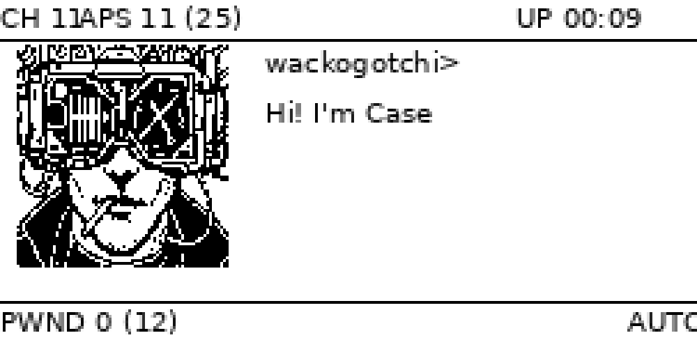

# pwnagotchi-neuromancer

Un thème pour [pwnagotchi](https://pwnagotchi.ai/) : la tête ASCII est remplacée
par un portrait cyberpunk en pixel art, et un écran **ICE BROKEN** s'affiche à
chaque handshake capturé.



*Rendu sur Waveshare 2.13" — agrandi ×4.*

> Validé sur un vrai Raspberry Pi Zero : portrait net, changements d'état,
> écran ICE BROKEN déclenché sur un handshake réel avec le SSID de la cible.

## Ce que ça fait

- remplace les 19 visages ASCII par 5 portraits en pixel art 1 bit
- affiche un écran dédié pendant quelques secondes après chaque handshake,
  avec le SSID de la cible
- réorganise la mise en page pour libérer la place du portrait

Le plugin **ne modifie pas** pwnagotchi : il s'installe comme plugin
personnalisé et se désactive en une ligne de config.

## Installation

Sur le pwnagotchi (pas depuis le PC) :

```bash
git clone https://github.com/wackojice/pwnagotchi-neuromancer.git
cd pwnagotchi-neuromancer
sudo ./install.sh
```

Le script copie les images, installe le plugin, active la ligne
`main.plugins.neuromancer.enabled = true` dans `/etc/pwnagotchi/config.toml`
(en sauvegardant l'ancien) et redémarre le service.

### Installation manuelle

```bash
sudo mkdir -p /usr/local/share/neuromancer
sudo cp images/*.png /usr/local/share/neuromancer/
sudo cp neuromancer.py le dossier `main.custom_plugins` (détecté automatiquement)
```

Puis dans `/etc/pwnagotchi/config.toml` :

```toml
main.plugins.neuromancer.enabled = true
```

```bash
sudo systemctl restart pwnagotchi
```

### Vérifier que ça tourne

```bash
journalctl -u pwnagotchi -f | grep neuromancer
```

Au démarrage, le plugin annonce le nombre d'images chargées.

## Compatibilité

**Le layout s'adapte tout seul à l'écran détecté.** Au démarrage, le plugin lit
le `layout()` du driver actif, repère la bande utile entre les deux filets
horizontaux, y place le portrait et en déduit la colonne de texte. Si le
portrait ne tient pas, les images sont réduites en `NEAREST` — sans
anti-aliasing, pour préserver le pixel art.

Vérifié par simulation sur quatre géométries :

| Écran | Portrait | Colonne de texte |
|---|---|---|
| Waveshare 2.13" (250 × 122) | 76 × 80 en y=16 | x=95 |
| Waveshare 1.54" (200 × 200) | 76 × 80 en y=16 | x=95 |
| Waveshare 2.7" (264 × 176) | 76 × 80 en y=16 | x=95 |
| Tricolore (212 × 104) | **réduit en 72 × 76**, y=14 | x=91 |

Développé sur **Waveshare 2.13" v2** avec le fork
[jayofelony/pwnagotchi](https://github.com/jayofelony/pwnagotchi) branche `noai`.

Pour forcer des coordonnées, remplacer `None` par un entier en haut du plugin :

```python
HAUT = None    # auto : juste sous le filet du haut
COL_D = None   # auto : après le portrait
```

## Le bandeau

Le plugin réécrit aussi les libellés de l'interface dans le lexique du roman :

| pwnagotchi | Neuromancer |
|---|---|
| `APS 9 (19)` | `NODES 9 (19)` |

`PWND` reste : c'est le compteur que toute la communauté pwnagotchi reconnaît,
et le renommer coûterait plus en lisibilité que ça ne rapporterait en style.
`ICE BROKEN` garde son sens sur l'écran de capture, où le contexte est
explicite. `UP` et `CH` restent également : l'élément d'uptime est déjà en
`x = 185` sur un écran de 250 px et un libellé plus long déborderait.

Ce renommage corrige au passage un défaut d'affichage de pwnagotchi. Un
`LabeledValue` place sa valeur à `x + espacement + 5 × len(libellé)`, en
comptant 5 px par caractère alors que la police en fait 6 : plus le libellé est
long, plus sa valeur remonte dessus — d'où le `CH 11APS` collé du rendu
d'origine. Le plugin repositionne les éléments et élargit l'espacement.

## La température du deck

Une ligne `DECK 44C` affiche la température du SoC, lue dans
`/sys/class/thermal/thermal_zone0/temp` toutes les `DECK_INTERVALLE` secondes.
Utile sur un Pi Zero, et raccord avec le vocabulaire — un cyberdeck qui chauffe.

Désactivable avec `DECK_TEMPERATURE = False`.

## Les visages

| Fichier | État | Correspondance |
|---|---|---|
| `awake.png` | neutre, visière allumée | `AWAKE`, `COOL`, `INTENSE`, `SMART`, `MOTIVATED` |
| `happy.png` | coin de la bouche relevé | `HAPPY`, `GRATEFUL`, `EXCITED`, `FRIEND` |
| `look_l.png` / `look_r.png` | regard de côté | `LOOK_L`, `LOOK_R` et leurs variantes *happy* |
| `sleep.png` | visière éteinte + zZz | `SLEEP`, `SLEEP2`, `BORED`, `LONELY`, `SAD`, `DEMOTIVATED` |
| `ice.png` | glace brisée | affiché après un handshake |

Toutes les images font 76-77 × 80, en **1 bit pur**, sans anti-aliasing.

Le `MAPPING` en haut du plugin se réorganise librement : plusieurs états peuvent
pointer vers la même image, et `awake.png` sert de repli pour tout état non prévu.

## La voix

Le thème ne change pas que les visages : il installe une **locale complète**
qui réécrit les 104 répliques de pwnagotchi dans l'univers de Gibson.

| pwnagotchi | Neuromancer |
|---|---|
| `Hi, I'm Pwnagotchi! Starting ...` | `Case online. Jacking in...` |
| `Hack the Planet!` | `Burn the ICE.` |
| `I'm bored ...` | `Static. Nothing but static.` |
| `I pwn therefore I am.` | `I break ICE, therefore I am.` |
| `I dreamed of electric sheep` | `I dreamed of Wintermute` |
| `Cool, we got 3 new handshakes!` | `ICE BROKEN. 3 keys.` |
| `It's a trap! {mac}` | `Black ICE for {mac}!` |
| `I'm dead, Jim!` | `I flatlined.` |

C'est du **gettext standard** : aucune ligne de pwnagotchi n'est modifiée. La
locale s'installe à côté des 184 autres et s'active par une ligne de config —

```toml
main.lang = "neuromancer"
```

— et se désactive en revenant à `main.lang = "en"`.

Les répliques tiennent toutes en 40 caractères, la limite d'affichage du statut
(20 caractères par ligne, deux lignes). Pour les modifier :

```bash
$EDITOR locale/neuromancer/LC_MESSAGES/voice.po
msgfmt -o locale/neuromancer/LC_MESSAGES/voice.mo \
       locale/neuromancer/LC_MESSAGES/voice.po
```

## Réglages

En haut de `neuromancer.py` :

| Constante | Rôle |
|---|---|
| `DOSSIER` | emplacement des PNG |
| `DUREE_PWN` | secondes d'affichage de l'écran ICE BROKEN |
| `DUREE_PHRASE` | durée minimale d'affichage d'une réplique (défaut : 6 s) |
| `LARGEUR_PHRASE` | caractères par ligne avant retour à la ligne |
| `FILE_MAX` | répliques gardées en attente (défaut : 3) |
| `LIBELLES` | libellés du bandeau à réécrire, avec position et espacement |
| `DECK_TEMPERATURE` | afficher la température du SoC |
| `DECK_INTERVALLE` | secondes entre deux lectures de température |
| `DEFAUT` | image de repli |
| `HAUT` | ordonnée du portrait — `None` = calculé depuis l'écran |
| `COL_D` | abscisse de la colonne de texte — `None` = calculé |
| `MARGE_X` | décalage du portrait depuis le bord gauche |
| `GOUTTIERE` | espace entre le portrait et le texte |

## Comment ça marche

Le plugin ne devine pas l'humeur : il **lit** ce que le cœur de pwnagotchi vient
d'écrire dans l'élément `face`, puis le traduit en fichier via `MAPPING`.

L'élément `face` n'est pas supprimé — le cœur continue d'y écrire — il est
déplacé hors du cadre visible. Les éléments `name` et `status` sont rapatriés en
colonne de droite pour libérer la place du portrait.

Un rafraîchissement e-ink coûte environ deux secondes : le plugin ne repeint que
lorsque l'image change réellement, jamais à chaque appel de `on_ui_update`.

**Les répliques restent lisibles.** pwnagotchi remplace son statut à chaque
événement, et leurs durées de vie n'ont rien de comparable : « Waiting for 40s »
reste quarante secondes, « I'm bored... » une seule. Lire le statut à intervalle
régulier ne montrerait donc que les phrases lentes.

Le plugin sort l'élément `status` du cadre, surveille chaque changement et
l'empile, puis défile à raison d'une réplique toutes les `DUREE_PHRASE`
secondes. La file est bornée à `FILE_MAX` : en cas de forte activité, les plus
anciennes sont abandonnées plutôt que de prendre du retard sur le présent.

Écrire dans `status` provoquerait une boucle : chaque écriture marque un
changement, qui déclenche un rendu, qui rappelle le plugin. Sur un e-ink à deux
secondes par rafraîchissement, l'écran clignoterait sans fin. Le plugin n'y
touche jamais.

## Dessiner ses propres visages

Deux principes, appris à la dure :

- **Des aplats pleins, pas du trait fin.** Un contour de 1 px disparaît ou
  crépite sur un e-ink ; une masse noire survit toujours.
- **Pas de primitives vectorielles.** Une bouche tracée à l'arc ou un texte posé
  avec une police jurent avec un dessin pixelisé. Dessiner à la main, à l'échelle
  finale.

## Licence

GPL-3.0 — comme pwnagotchi, dont ce plugin utilise les interfaces.

Le nom et l'esthétique font référence au roman *Neuromancer* de William Gibson.
Projet non officiel, sans affiliation.

## Prévisualiser sans matériel

Le dépôt embarque un outil qui recompose l'écran 250 × 122 à l'identique du
layout `waveshare2in13_V2` — mêmes coordonnées, mêmes polices, même mode 1 bit —
pour juger le rendu sans pwnagotchi ni e-ink :

```bash
./tools/preview.py                # tous les états + une planche
./tools/preview.py ice --zoom 6   # un seul état, agrandi
```

Les PNG sortent dans `preview/` (ignoré par git). Nécessite Pillow, et
`DejaVuSansMono` pour un rendu fidèle (`sudo pacman -S ttf-dejavu` sur Arch) —
le script bascule sinon sur une autre police monospace en prévenant.
